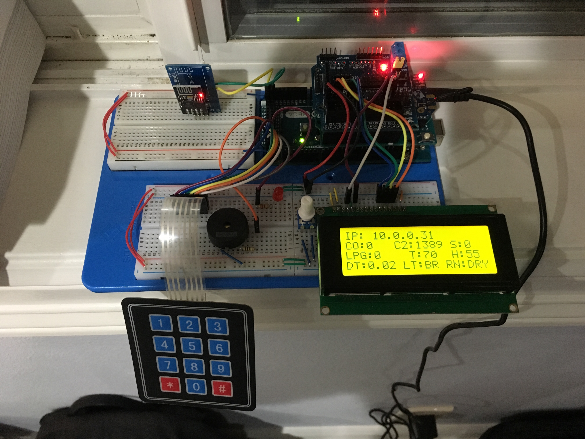
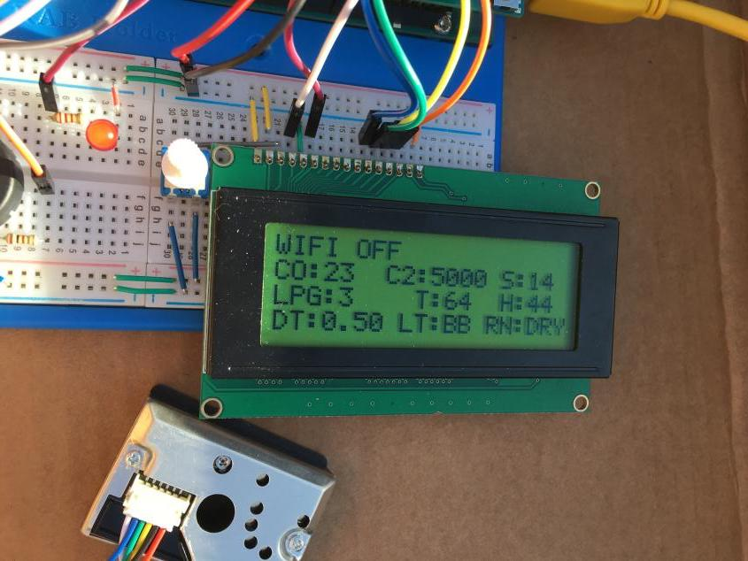
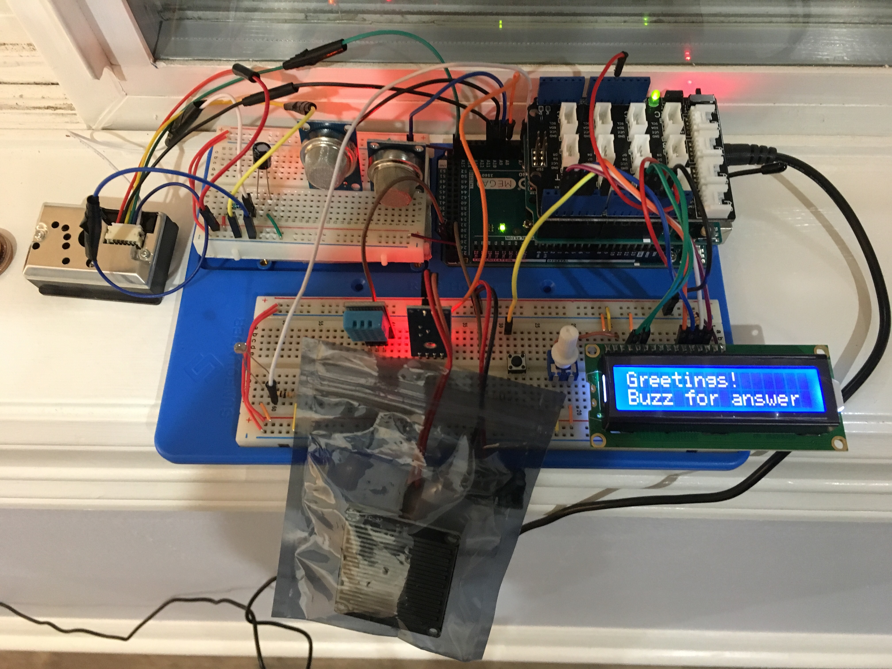
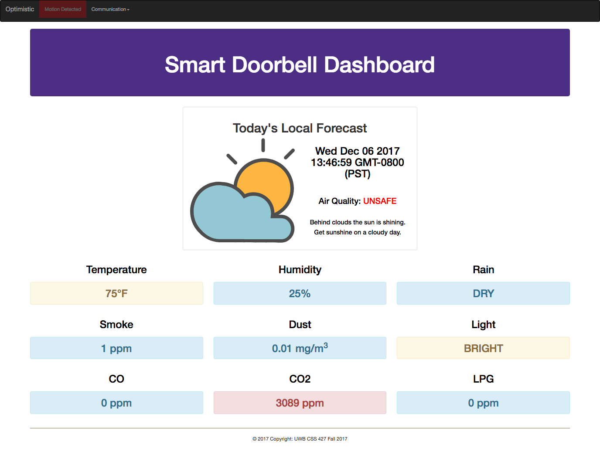

# CSS 427 Final Project
The IoT device is a smart doorbell that consists of a master and slave Arduino devices.
#### *The submission is not LIVE due to devices need to be running. The following error will occur as inspected by the browser:*

```Failed to load file:///Users/faraonc/Documents/BIMD233/bimd233/project/final-project/site/ajax: Cross origin requests are only supported for protocol schemes: http, data, chrome, chrome-extension, https.```

#### *There is no CSS file. Styling is done using JS and BootStrap to decrease library overhead.*

### Primary Source of inspiration

The primary source of inspiration is to build an embedded system project that is meaningful and useful for the user like given from the Arduino project blog.
[Link to Arduino project blog](https://blog.arduino.cc/)

------

### Arduino Master
------


The primary job of the master device is to activate the buzzer if the slave's doorbell is pressed.

The master device serves as a base station that sits inside a house which periodicaly communicates or demands the Arduino slave device to get the following data from outside or a particular location of the slave:

  - Temperature in Fahrenheit
  - Humidity
  - Carbon Monoxide in PPM
  - Carbon Dioxide in PPM
  - Smoke in PPM
  - Dust in PPM
  - LPG in PPM
  - Brightness
  - Rain Status
  - Motion Detection
  
 

The master device serves as a webserver for any terminal with browser capability. The master device sends a HTML document to the requesting client. The code snippet below shows the string declarations in the master's source code.

```
const String H0 = "HTTP/1.1 200 OK\nContent-type:text/html\nConnection: close\n\n";
const String H1 = "<!DOCTYPE html><html><head><meta charset=\"utf-8\">";
const String ICO_PATH = "<link rel=\"icon\" href=\"data:,\">";
const String H2 = "<link rel=\"stylesheet\" href=\"https://maxcdn.bootstrapcdn.com/bootstrap/3.3.7/css/bootstrap.min.css\">";
const String H3 = "<script src=\"https://ajax.googleapis.com/ajax/libs/jquery/3.2.0/jquery.min.js\"></script>";
const String H4 = "<script src=\"https://maxcdn.bootstrapcdn.com/bootstrap/3.3.7/js/bootstrap.min.js\"></script>";
const String H5 = "</head><body><nav class=\"navbar navbar-inverse\"><div class=\"container-fluid\">";
const String H6 = "<div class=\"navbar-header\"><p id=\"team\" class=\"navbar-brand\"></p></div><ul class=\"nav navbar-nav\">";
const String H7 = "<li> <a href=\"/U\" id=\"blink\">";

const String H8 = "</a></li><li class=\"dropdown\"><a class=\"dropdown-toggle\"data-toggle=\"dropdown\" href=\"#\">Communication";
const String H9 = "<span class=\"caret\"></span></a><ul class=\"dropdown-menu\"><li><a>Master to Slave: ";
const String H10 = "</a></li><li><a>Slave to Master: ";
const String H11 = "</a></li><li><a>Master to Terminal: ";
const String H12 = "</a></li><li><a>Terminal to Master: ";
const String H13 = "</a></li></ul></li></ul></div></nav>";
const String H14 = "<div class=\"container-fluid text-center\">";
const String H15 = "<div id=\"jumbox\" class=\"jumbotron jumbotron-fluid\"><h1 id=\"db-header\"></h1></div>";

const String J1 = "<div id=\"weather\"><h1></h1><div class=\"row\"><div class=\"col-sm-6\"></div>";
const String J2 = "<div class=\"col-sm-6\"><h2 id=\"date-today\"></h2><br><h3 id=\"air-quality\">Air Quality: <span></span>";
const String J3 = "</h3><br><h4 id=\"status-day\"></h4><h4 id=\"advice-day\"></h4></div></div></div><br><br>";

const String H16 = "<div class =\"row\"><div class=\"col-sm-4\"><h2>Temperature</h2><h2 id=\"temp-value\">";

const String H17 = "&#8457;</h2></div><div class=\"col-sm-4\"><h2>Humidity</h2><h2 id=\"humid-value\">";

const String H18 = "%</h2></div><div class=\"col-sm-4\"><h2>Rain</h2><h2 id=\"rain-value\">";

const String H19 = "</h2></div></div>";
const String H20 = "<div class=\"row\"><div class=\"col-sm-4\"><h2>Smoke</h2><h2 id=\"smoke-value\">";

const String H21 = " ppm</h2></div>";
const String H22 = "<div class=\"col-sm-4\"><h2>Dust</h2><h2 id=\"dust-value\">";

const String H23 = " mg/m<sup>3</sup></h2></div>";
const String H24 = "<div class=\"col-sm-4\"><h2>Light</h2><h2 id=\"light-value\">";

const String H25 = "</h2></div></div>";
const String H26 = "<div class =\"row\"><div class=\"col-sm-4\"><h2>CO</h2><h2 id=\"co-value\">";

const String H27 = " ppm</h2></div>";
const String H28 = "<div class=\"col-sm-4\"><h2>CO2</h2><h2 id=\"co2-value\">";

const String H29 = " ppm</h2></div><div class=\"col-sm-4\">";
const String H30 = "<h2>LPG</h2><h2 id=\"lpg-value\">";

const String H31 = " ppm</h2></div></div><hr><p id=\"foot\"></p><div>";
const String H32 = "<script src=\"http://students.washington.edu/faraonc/Arduino/webpage/smdb.js\"></script></body></html>";
```

Lastyly, dynamic update of the webpage is done by sending a JSON string in order to service a client via the client's AJAX object request.

```
void sendAjaxRequest()
{
  String json_data = "{\"motion\":\"" + getMotion();
  json_data.concat("\",\"master_slave\":\"" + String(syn + syn_master_payload + ack_from_master_to_slave));
  json_data.concat("\",\"slave_master\":\"" + String(syn_slave + syn_slave_payload + ack_from_slave_to_master));
  json_data.concat("\",\"master_terminal\":\"" + String(syn_terminal));
  json_data.concat("\",\"temp\":\"" + String(temperature));
  json_data.concat("\",\"humid\":\"" + String(humidity));
  json_data.concat("\",\"dust\":\"" + String(dust));
  json_data.concat("\",\"co\":\"" + String(co));
  json_data.concat("\",\"co2\":\"" + String(co2));
  json_data.concat("\",\"smoke\":\"" + String(smoke));
  json_data.concat("\",\"lpg\":\"" + String(lpg));
  json_data.concat("\",\"rain\":\"" + getRain());
  json_data.concat("\",\"light\":\"" + getLight());
  json_data.concat("\",\"terminal_master\":\"" + String(ack_terminal) + "\"}");
  client.print(H0);
  client.print(json_data);
}
```

 
### Arduino Slave
------



The primary job of the slave device is to notify the base station with a guest using the doorbell.

The slave device gathers data related to air quality, temperature, humidity, motion, rain status, and brightness. These data are peridiocally reported to the master device or as demanded by the master device.

### IoT Dashboard
------



The dashboard is used to monitor and to periodically updates the user of the status and data collected from the slave device through the master device as the web server. The communication is done using Wi-Fi.

The dashboard uses jQuery and AJAX to populate the webpage and to interpret meaningful data without having to reload the entire page.

Additionally, the script and images are hosted in the following website.
[Link to weather icons](http://students.washington.edu/faraonc/Arduino/webpage/images/)
